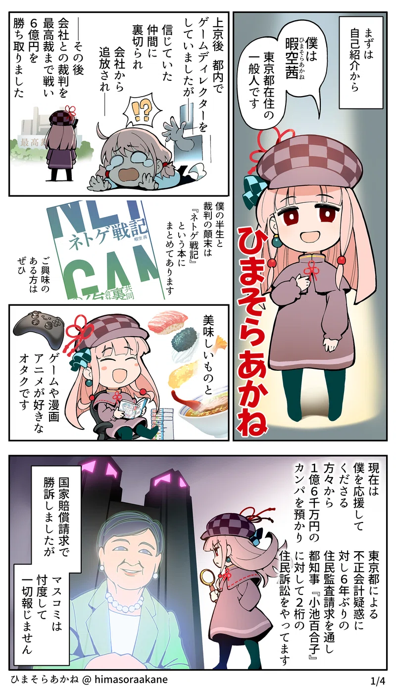
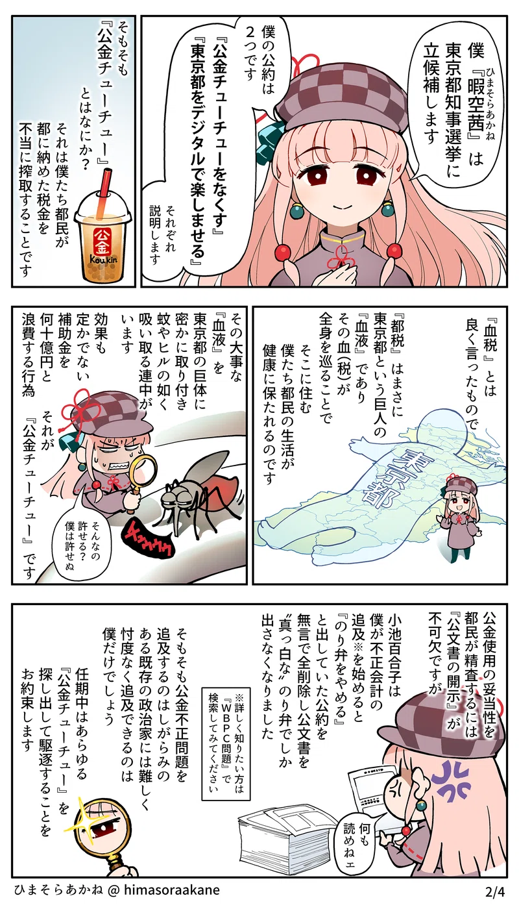
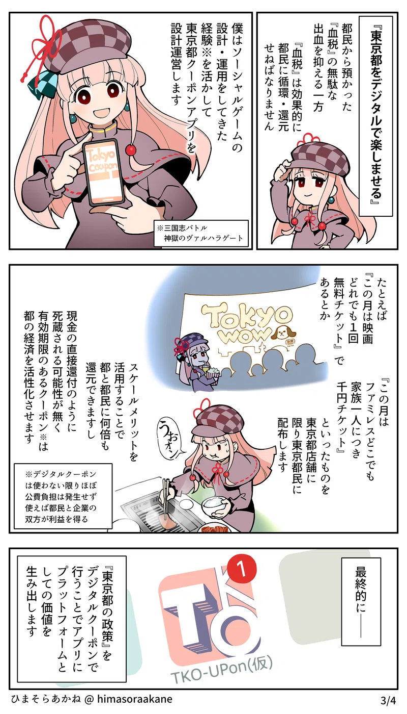
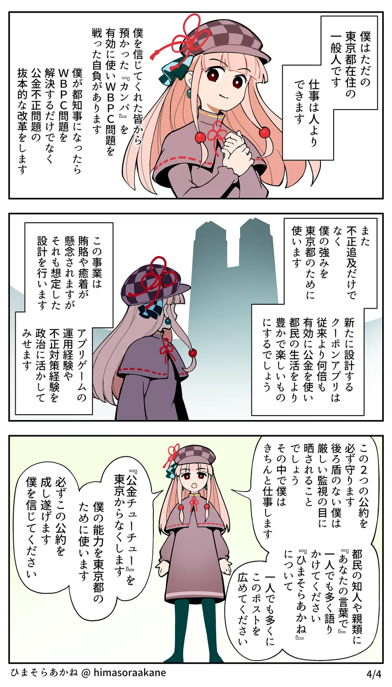

# 概要
--------

## 公約

[ひまそらあかねの政策集](https://note.com/hima_kuuhaku/n/n00a0ba9943d1)より、

1. [公金チューチューをなくす](/docs/himasoraakane/chuchu.md)
2. [東京都をデジタルで楽しませる](/docs/himasoraakane/coupon.md)
3. 政治献金の一切を受け取りません
  - 個人献金、企業献金、政治資金パーティの全て

その他政策・表明として、
- [作品・文化を守る](/docs/himasoraakane/sakuhin.md)
- [東京を良くする](/docs/himasoraakane/toyko.md)
  - 警察・教員の待遇向上など

その他政策については[ひまそらあかねの政策集#政策集](https://note.com/hima_kuuhaku/n/n00a0ba9943d1#749fcb71-c836-4e3f-b672-e6231960d01d)に記載がある

公約について漫画があったので掲載

## 行動・実績

- 主に東京都の若年被害女性等支援事業について公金不正支出があるとして複数の訴訟を提起している。
  - 詳しくは[こちら](/docs/himasoraakane/sosyou.md)
  - 本件はひまそらあかね氏の公約である[公金チューチューをなくす](/docs/himasoraakane/chuchu.md)と大きく関係している。
  - 小池ゆりこ氏が特別顧問を務める都民ファーストの会の公約[「のり弁*やめます」が削除された件](/docs/koike_yuriko/noriben.md)とも大きく関係している。

## 支援者

## リンク集
- [選挙公報](https://r6tochijisen.metro.tokyo.lg.jp/public/files/R06tochiji_kouhou_kobetsu_52.pdf#view=FitH)
- [Xアカウント（ホームページ扱い）](https://twitter.com/himasoraakane/)