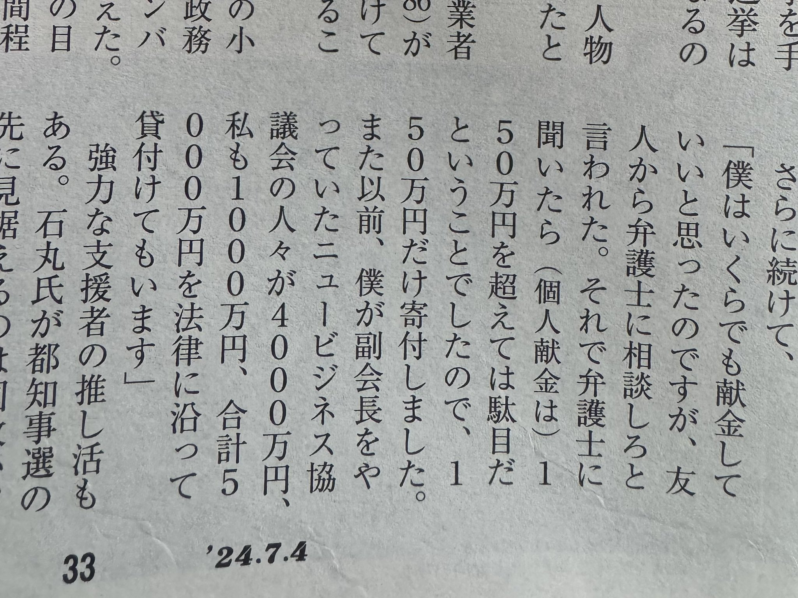

# 概要
--------

## 公約

### 東京を動かそう

[ホームページ](https://ishimaru-shinji.com/)より、

1. [政治再建](/docs/ishimaru_shinji/seiji_saiken.md)
2. [都市開発](/docs/ishimaru_shinji/toshi_kaihatsu.md)
3. [産業創出](/docs/ishimaru_shinji/sangyo_sosyutsu.md)

## 行動・実績

### 訴訟・問題

- 2022年9月、台風接近中に千葉県で開催されたトライアスロンに参加した
- 石丸氏がX上で「数名の市議から恫喝を受けた」と投稿、その後もある一人の市議を批判する投稿を続けた。市議が根拠のない誹謗中傷で政治活動を妨害されたとして提訴。
- [ポスター未払問題](/docs/ishimaru_shinji/poster.md)
  - 石丸氏に対して、令和2年の安芸高田市長選で石丸氏側が発注した選挙ポスターなどの製作費の一部が支払われていないとして広島市内の印刷業者が提訴した件

### 安芸高田市長: 2020年8月9日～2024年6月9日

- 安芸高田市長としての実績は[こちら](/docs/ishimaru_shinji/shicho.md)

## 支援者
- 鳥羽博道（ドドールコーヒー社長）: 後援会会長, 1000万円の貸付
- 一般社団法人東京ニュービジネス協議会(NBC): 会員が4000万円の貸付
  - 安芸高田市長時代に、安芸高田市とNBCで[包括連携協定を結んでいる](https://www.nbc-world.net/C21/view_news/MzY0NjA2AQA)
  - 参考: 週刊新潮の鳥羽氏へのインタビュー

## リンク集
- [選挙公報](https://r6tochijisen.metro.tokyo.lg.jp/public/files/R06tochiji_kouhou_kobetsu_07.pdf#view=FitH)
- [ホームページ](https://ishimaru-shinji.com/)
- [東京を動かす move to tokyo](https://movetotokyo.net/)
