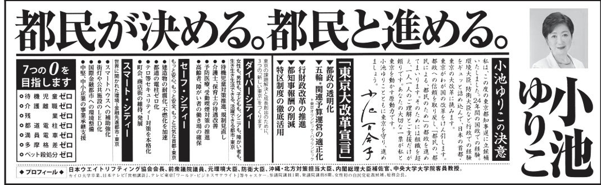
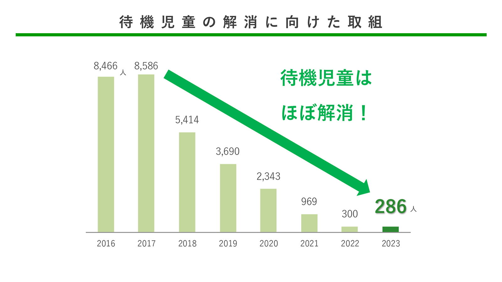
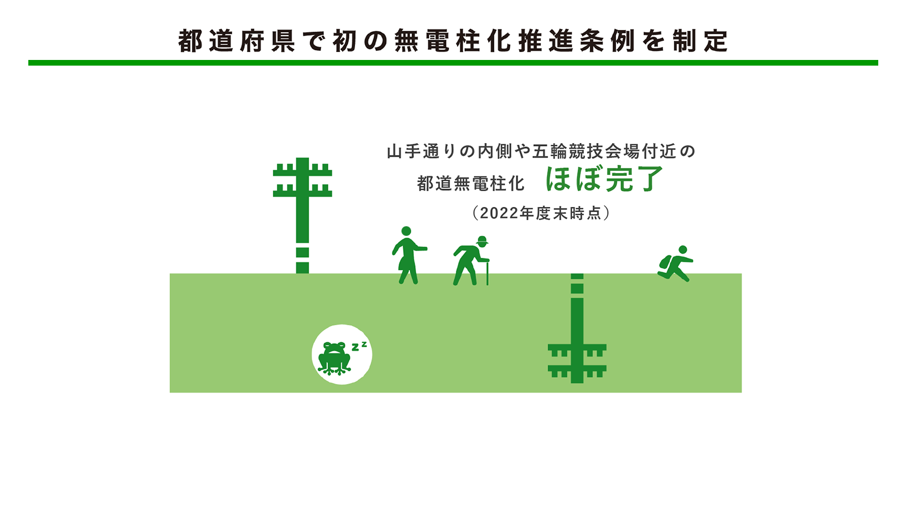
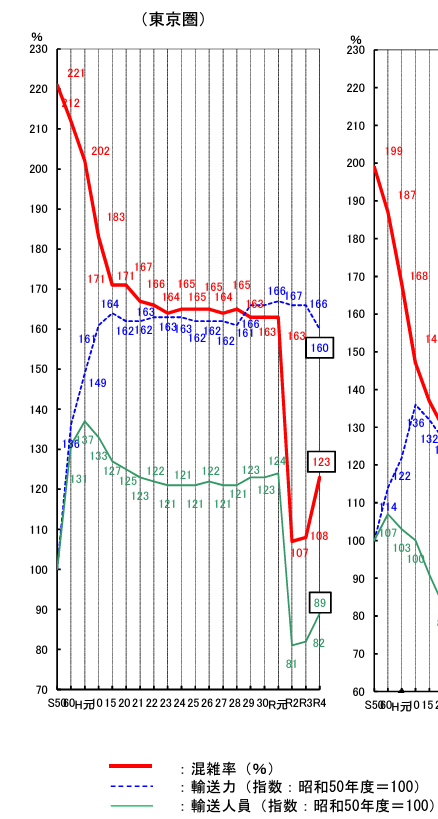
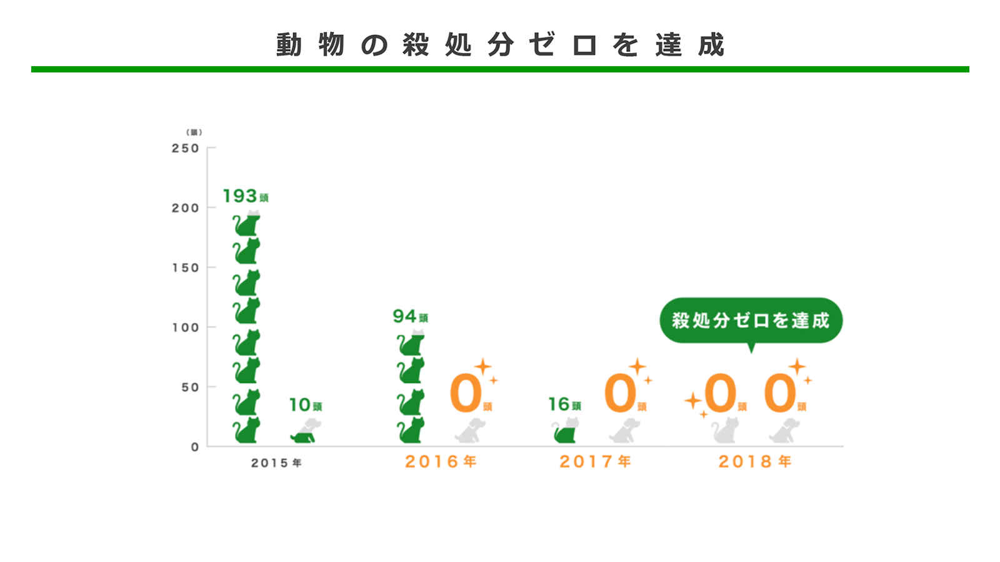

# 行動・実績: 7つのゼロ
------------------------

[2016年 都知事選の選挙公報](https://www.city.tama.lg.jp/_res/projects/default_project/_page_/001/005/422/28.7.31.pdf)より、下記の公約が掲げられていた

### 待機児童ゼロ

[小池ゆりこ公式Webの実績ページ](https://www.yuriko.or.jp/result)より、
待機児童は2016年の8,466人人から2023年には286人に減少しており、ほぼ達成としている

### 介護離職ゼロ

悪化している。総務省の調査（就業構造基本調査）によると、都内で「介護・看護」を理由に離職した人は、17年の7800人から22年は1万4200人と倍増した。

参考: [令和4年就業構造基本調査](https://www.stat.go.jp/data/shugyou/2022/index2.html)

### 残業ゼロ

公式の統計は見当たらなかったが、本庁勤務職員の月平均の残業時間は23.5時間と言われている

参考: [東京新聞: 「7つのゼロ」小池百合子都政8年で達成したのは何？　一つ一つ状況をチェックすると〈検証小池都政〉](https://www.tokyo-np.co.jp/article/333854)

### 都道電柱ゼロ

[小池ゆりこ公式Webの実績ページ](https://www.yuriko.or.jp/result)より、センター・コア・エリア*については達成されたとしている

都内全域では16年の39%から22年度の46%の上昇となった

*センター・コア・エリア＝首都高速道路中央環状線の内側のエリア

### 満員電車ゼロ
[国土交通省の報道発表資料](https://www.mlit.go.jp/report/press/content/001619671.pdf)によると、東京圏の路線でラッシュ時の主要区間における乗車人数を平均化した混雑率は、16年の165％から22年は123％に低下した。

(KingYoSunコメント) 令和元年(2019年) -> 令和2年(2020年)で急減少しており、これは明らかにコロナの影響であると考えられる。また、令和二年以降は増加傾向に戻っていることからも、都政の影響とは考えられない。

### 多摩格差ゼロ

的確な指標が見当たらなかったが、[小池ゆりこ公式Webの実績ページ](https://www.yuriko.or.jp/result)によると、多摩・島しょ地域振興の予算を16年度の490億円から130億円増額し、24年度が620億円の予算を確保したとしている

### ペット殺処分ゼロ

[小池ゆりこ公式Webの実績ページ](https://www.yuriko.or.jp/result)より、達成されたとしている

