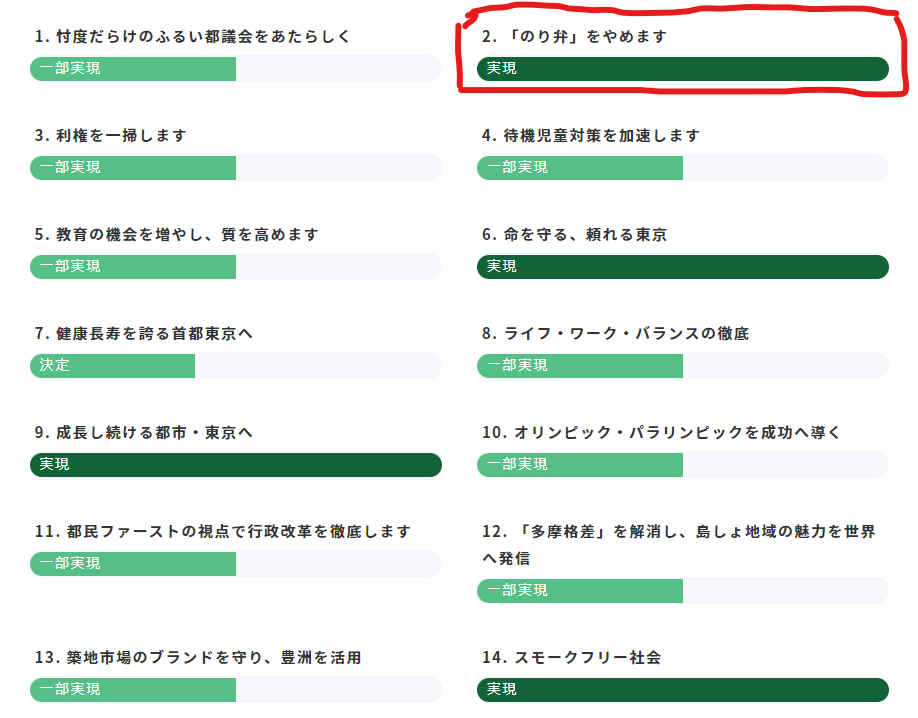

# 行動・実績: のり弁をやめます
--------------------------------

### 背景

小池ゆりこ氏が創始者であり、特別顧問を務める「都民ファーストの会」にて、「のり弁*をやめます」との公約があった

*のり弁 = 開示請求などによって公開された文章が黒く塗りつぶされており、実質的に情報が開示されていないこと

### 公約削除

2023年1月29日時点では都民ファーストの会ホームページに「[公約の進捗（外部リンク: アーカイブページ）](https://web.archive.org/web/20230129192918/https://tomin1st.jp/policy/1209/)」があり、「「のり弁」をやめます」の項目が「実現」になっていた

2023年2月17日時点で該当ページが削除された。

https://tomin1st.jp/policy/1209/

### 原因？

2024年都知事選に出馬している[ひまそらあかね氏](/docs/himasoraakane)が都のDV交付金について開示請求を行ったところ、[黒塗りの書類が提出された](https://note.com/hima_kuuhaku/n/n74adf9da5e11)(2022年12月)。

本件に関してひまそらあかね氏は[東京都に非開示処分取り消し訴訟を提起した](https://note.com/hima_kuuhaku/n/n1141e3c72d70)(2022年12月)。

（KingYoSunコメント）上記の件について、時期が近いことから公約削除に影響したのではないかと考えられる。

その他にも、東京新聞が、都が国に回答したIRについての意向調査結果を情報公開請求したところ、ほぼすべて黒塗りという「のり弁」状態で開示されたこともある。

参考: [東京新聞: カジノ誘致の文書「真っ黒」でも小池都知事が説く「情報公開は１丁目１番地」](https://www.tokyo-np.co.jp/article/34979)